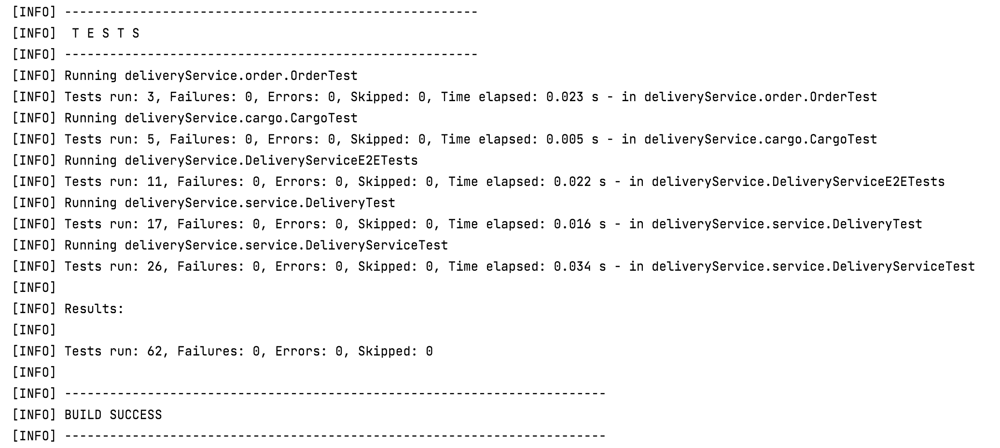
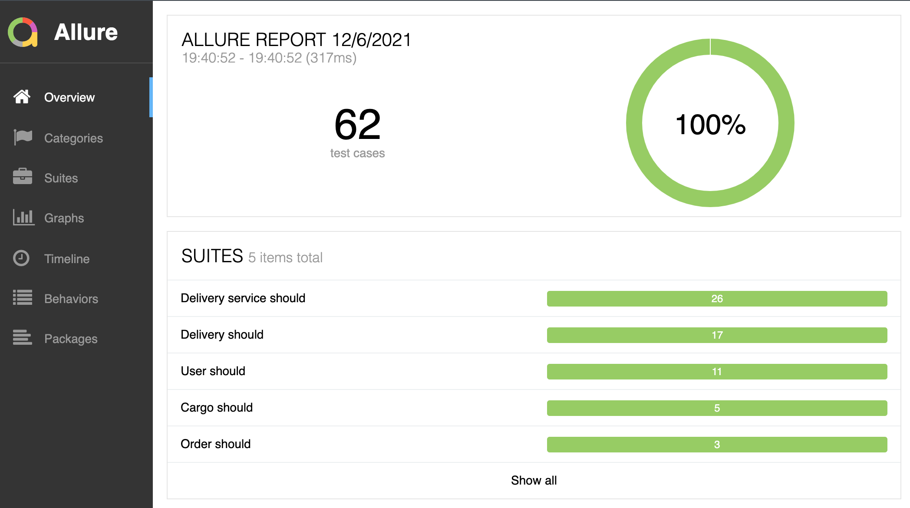

# Delivery service demo

Small example/practice to demonstrate testing of java code with JUnit.
To build the project, execute tests and generate test report, use the following commands:

- to build the project 
```
mvn install
```

- to run tests
```
mvn test
```


- to run tests, generate and open html-report
```
mvn test allure:report allure:serve
```


## Quick overview

The project based on maven-project structure, all production code is located in the following directory:
```
src/main/java/deliveryService
```
- `cargo/Cargo.java` - the class that represents a cargo that needs to be delivered
- `order/Order.java` - the class that represents an order for the delivery service. Takes an instance of a ```Cargo``` and allows to set a delivery distance
- `service/DeliveryService.java` - main class where all calculations happen. The most important method of its public interface is `calculateOrderDelivery(Order)` that takes an instance of an ```Order``` class and returns the calculated ```Delivery```
- `service/Delivery.java` - the class that represents a delivery calculated by the service. Contains the details about the delivery price, commissions and errors 
- `examples/DeliveryDemoEntry.java` - simple example of a user interface to demonstrate the service in work

All testing code is located in the following directory:
```
src/test/java/deliveryService
```
- `cargo/CargoTest.java` - unit tests for the Cargo class
- `order/OrderTest.java` - unit tests for the Order class
- `service/DeliveryTest.java` - unit tests for the Delivery class
- `service/DeliveryServiceTest.java` - unit tests for the DeliveryService class
- `e2e/DeliveryServiceE2ETests.java` - "E2E" tests for the DeliveryService class
## Examples
To run a basic example using Delivery service:

- Create a ```Cargo``` class specifying a width, height, depth and fragility of a cargo you want to deliver

    ```java
    Cargo cargo = new Cargo(width, height, depth, false);
    ```
- Create an ```Order``` class that takes that ```Cargo``` instance, and set a distance of the desired delivery
    ```java
    Order order = new Order(cargo).setDistance(distance);
    ```
- Create a ```DeliveryService``` instance and set desired workload to the service (```REGULAR``` by default)
  ```java
  DeliveryService deliveryService = new DeliveryService().setWorkload(Workload.INCREASED);
  ```
- Call ```.calculateOrderDelivery(order)``` method of the service, passing created order to it. Method returns a ```Delivery``` object with the computed result for the delivery
  ```java
  Delivery delivery = deliveryService.calculateOrderDelivery(order);
  ```
- Once delivery is calculated there are several methods that can be called, e.g.
  ```java
  delivery.getDeliveryPrice(); // get a calculated price of a specified delivery
  delivery.isError(); // check if there was an error during the price calculation
  delivery.getErrorMessage(); // get a descriptive error message if there was an error
  delivery.getDistanceCommission(); // get a commission the service takes for the specified delivery distance
  delivery.printResults(); // print calculation results to the console
  ```
  
####Example #1
Input:
```java
Cargo cargo = new Cargo(100, 270, 340, false);
Order order = new Order(cargo).setDistance(34);

DeliveryService deliveryService = new DeliveryService();
deliveryService.calculateOrderDelivery(order).printResults();
```
Output:
```
ORDER DETAILS
----------------------------------------------
Distance:                             34.00km
Fragile:                                false
Cargo size:    100.00cm x 270.00cm x 340.00cm


Delivery distance commission:       300.00RUB
Cargo dimensions commission:        200.00RUB
Fragile cargo commission:             0.00RUB
----------------------------------------------
TOTAL:                              500.00RUB
```
####Example #2
_(same cargo and distance, different workload)_

Input:
```java
Cargo cargo = new Cargo(100, 270, 340, false);
Order order = new Order(cargo).setDistance(34);

DeliveryService deliveryService = new DeliveryService().setWorkload(Workload.VERY_HIGH);
deliveryService.calculateOrderDelivery(order).printResults();
```
Output:
```
ORDER DETAILS
----------------------------------------------
Distance:                             34.00km
Fragile:                                false
Cargo size:    100.00cm x 270.00cm x 340.00cm


Delivery distance commission:       300.00RUB
Cargo dimensions commission:        200.00RUB
Fragile cargo commission:             0.00RUB

Service fee:*                       300.00RUB
----------------------------------------------
TOTAL:                              800.00RUB

* Service fee depends on the current workload
(Current workload is very high)
```
####Example #3
_(fragile cargo and a long distance)_

Input:
```java
Cargo cargo = new Cargo(12, 10, 15, true);
Order order = new Order(cargo).setDistance(31);

DeliveryService deliveryService = new DeliveryService();
deliveryService.calculateOrderDelivery(order).printResults();
```
Output:
```
Sorry, delivery of a fragile cargo is not available for the specified distance
Maximum distance for a fragile cargo:        30.00km
Order distance:                              31.00km
```
####Example #4
_(minimum price is set)_

Input:
```java
Cargo cargo = new Cargo(1, 1, 1, false);
Order order = new Order(cargo).setDistance(1);

DeliveryService deliveryService = new DeliveryService();
deliveryService.calculateOrderDelivery(order).printResults();
```
Output:
```
ORDER DETAILS
----------------------------------------------
Distance:                              1.00km
Fragile:                                false
Cargo size:          1.00cm x 1.00cm x 1.00cm


Delivery distance commission:        50.00RUB
Cargo dimensions commission:        100.00RUB
Fragile cargo commission:             0.00RUB
----------------------------------------------
TOTAL:*                             400.00RUB

* 400.00RUB is the minimum delivery price
```